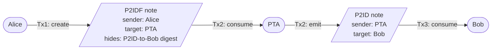

# miden-anonymizer

A standalone Rust crate implementing a **Pass-Through Account (PTA)** on Miden.

The PTA breaks the on-chain linkage between sender and receiver of a private
payment:

1. Alice creates a private **P2IDF** ("P2ID-Forward") note addressed to the PTA.
   Its storage encodes the precomputed P2ID recipient digest of the outbound
   note that should eventually land in Bob's inbox (Bob's account ID is
   committed to inside that digest, never in plaintext).
2. Anyone can execute a transaction against the PTA that consumes the P2IDF
   note. The PTA's custom auth (`VaultEmptyAuth`) asserts that the vault's
   root is the same at the start and end of the transaction (vault delta =
   zero). Combined with the PTA being created with an empty vault, this
   keeps the PTA strictly pass-through. The note script drains Alice's asset
   into the PTA vault, builds a standard P2ID note using the precomputed
   recipient, and moves the asset out of the PTA vault into that outbound
   note.

On-chain an observer sees two independent flows: _someone_ sent to PTA; _PTA_
sent to Bob. The inbound note is private (only its nullifier is posted) and the
outbound note's `sender` is the PTA, not Alice.

### Flow



- **Tx1** is signed by Alice. It drains Alice's vault into the P2IDF note.
- **Tx2** is signed by the PTA (no signature actually required — `VaultEmptyAuth`
  is a pure assertion). It consumes the P2IDF and, in the same transaction,
  emits the P2ID note to Bob. Asset transit through the PTA's vault is
  net-zero, enforced by the start/end vault-empty checks.
- **Tx3** is signed by Bob whenever he chooses to redeem. The note's `sender`
  field reads `PTA`, never `Alice`.

## Layout

```
miden-anonymizer/
├── Cargo.toml
├── build.rs                          # compiles MASM to .masl
├── masm/
│   ├── account_components/
│   │   └── auth/
│   │       └── vault_empty.masm      # PTA custom auth
│   └── standards/
│       └── notes/
│           └── p2id_forward.masm     # the P2IDF note script
├── src/
│   ├── lib.rs
│   ├── library.rs                    # loads compiled MASM libraries
│   ├── errors.rs
│   ├── account/
│   │   ├── mod.rs
│   │   ├── auth.rs                   # VaultEmptyAuth component
│   │   └── pta.rs                    # PassThroughAccount builder
│   ├── note/
│   │   ├── mod.rs
│   │   └── p2id_forward.rs           # P2idForwardNote
│   └── bin/
│       └── pta_single_hop_demo.rs    # rust-client style demo
└── tests/
    ├── single_hop.rs
    └── auth_invariants.rs
```

## v1 scope

- Single deployed PTA account, public storage, immutable code.
- Components: `VaultEmptyAuth` + `BasicWallet`.
- P2IDF notes can carry **up to `MAX_ASSETS_PER_NOTE` (= 64) assets**, all
  forwarded together through the PTA into a single outbound P2ID note.
- No retry logic, no sharding, no denomination whitelist, no network txs.

## v1 known limitations

- **Same-block contention**: two users submitting against the PTA in the same
  block will race; one succeeds, the other must re-prove next block.
- **Amount correlation**: inbound amount equals outbound amount. Mitigated by a
  denomination whitelist in v2.
- **Timing correlation**: inbound and outbound happen in the same block.
  Mitigated by a delayed-outbound mechanism in v2.
- **Anonymity set** = senders routing through the PTA in the same time
  window. Small by default; grows with adoption.

## Deployed public PTA (Miden testnet)

A public, immutable-code PTA is live on Miden testnet:

- **bech32**: `mtst1azy607tkxe7fyqq604l2ysp55qqs2whr`
- **explorer**: <https://testnet.midenscan.com/account/mtst1azy607tkxe7fyqq604l2ysp55qqs2whr>
- **deploy tx** (the first P2IDF forward — that's how the PTA got committed
  to chain): <https://testnet.midenscan.com/tx/0xdead6a5083f94f63542fd3ca432579bffbb650c98afe53507747c78778de7c83>

Because the PTA's auth (`VaultEmptyAuth`) requires no signature, *any* fresh
client can submit a transaction against it — no shared keys, no shared store,
nothing out-of-band beyond the public bech32 above. See `src/bin/use_pta.rs`
for a working example, and `tests/testnet.rs::any_client_can_use_public_pta`
for the same flow as a `#[ignore]` integration test.

## Build & run

```
# library + MockChain tests
cargo build
cargo test

# deploy a fresh PTA on testnet (prints its bech32 + midenscan link)
cargo run --release --features cli --bin deploy_pta

# drive a P2IDF forward against the already-deployed public PTA above
cargo run --release --features cli --bin use_pta
# or, against a different PTA:
cargo run --release --features cli --bin use_pta -- <pta-bech32>
```

The CLI binaries pull in `miden-client`; they're gated behind the `cli`
feature so library consumers that only want the PTA primitives don't pay the
cost of the full client stack.
